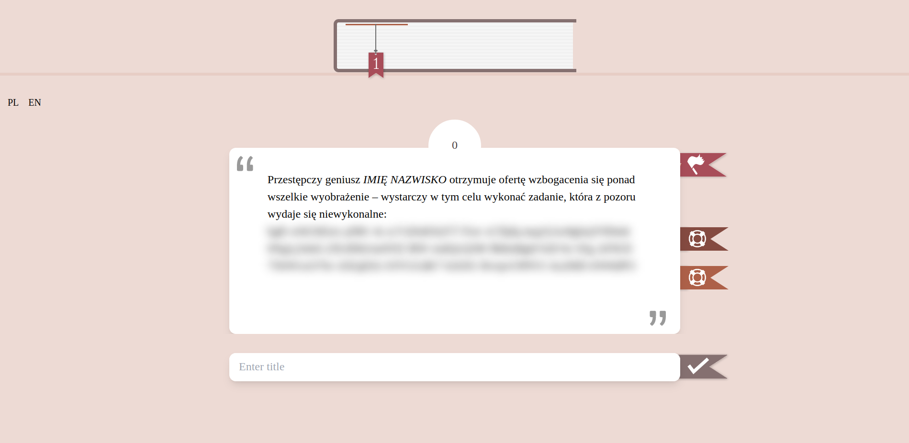

# FirstSentenceGuess
## About
A simple web quiz app inspired by BookTube (Youtube but only books) First Sentance Challange. The app is made in Rust (actix-web) and handle all the logic on the server side. The frontend is built with HTMX and Tailwind CSS. User progress, points, and preferences are stored in the web session using actix_session.

Right now, the app uses a JSON file as its database, which it reads at startup. It's not the best setup for this kind of app since everyone plays the same quiz without the option to switch things up on the fly. Essentially, all users see the same content, and only their progress and preferences are stored in their web session. Maybe down the line, I'll revamp things to allow for multiple quizzes and users, but for now, that's how it rolls.



## Config
There is only one config file with 4 options. The config has to be in the app working dir and has to be named `config.toml`. The config options are listed below:

- `bind_host`: DNS name or IP address of the app host (default: `"0.0.0.0"`)
- `bind_port`: Port where the app listens (default: `8000`)
- `db_file`: Path to the JSON database file (required, no default value)
- `db_safe`: If set to `true`, HTML in the database file won't be escaped, potentially insecure (default: `false`)

## Database
As mentioned before, the database needs to be a JSON file. Here's how the structure looks:
```json
[
{
    "title": "title of the book",
    "title_alter": "alternative title of the book (short or other language)",
    "author": "N. Surname of the author (N. Surname format is recomended)",
    "genre": "Genre of the book",
    "sentences": [ "first sentence of the book or the book blurb(with html tags if you want)",
   "second sentence of the book <br>",
   "– third sentence" ]
  },
  {...}
]
```
The database can contain as many elements as you want, but the graphical indicator only accommodates up to 10 elements.

## Run with cargo
Run this commands  in your terminal to copy the repo:
```bash
git clone https://github.com/Nithe14/FirstSentenceGuess
cd FirstSentenceGuess
```
You can simply run the app to play with it:
```bash
cargo run
```
Or you can install it to the current path for example:
```bash
cargo install --path .
./fsg
```
## Run with docker:
There's a Docker image hosted on `ghcr.io/nithe14/fsg`, allowing you to pull the image and run your Docker container. Currently, only the `latest` tag is available.

You can easily use the provided docker-compose.yml file:
```bash
git clone https://github.com/Nithe14/FirstSentenceGuess
cd FirstSentenceGuess
docker-compose up
```
Remember to change your `config.toml`, `db_file` path in the config and database file:

your-config.toml
```toml
...
db_file = "/path/to/your-db.json"
...
```

docker-compose.yml
```yml
...
    volumes:
    - ./your-config.toml:/config.toml
    - /path/to/your-db.json:/path/to/your-db.json
```

## Playing the quiz

Since it's a quiz, you shouldn't have access to the database directly. The app is designed similar to the First Sentence Challenge on BookTube. Someone sets up the database and runs an instance of the app for you. As a player, you should only have access to the app through a web browser.

### Points
For every book guessed correctly, you can earn a maximum of 5 points.

You lose 1 point for each of the following actions:

- Guessing incorrectly
- Displaying the next sentence
- Using any of the help options with the help button

Even if you lose more than 5 points, if you guess the book correctly, you'll still receive at least one point.

However, if you give up on guessing the book using the give-up button, you won't receive any points for this book.

### Session
Currently, there isn't a button available to clear the web session, and the session itself doesn't clear automatically either. You'll need to use your browser's built-in tools to clear the cookies.

## Known Issues
- #1 Refreshing a page takes user back to sentences view
